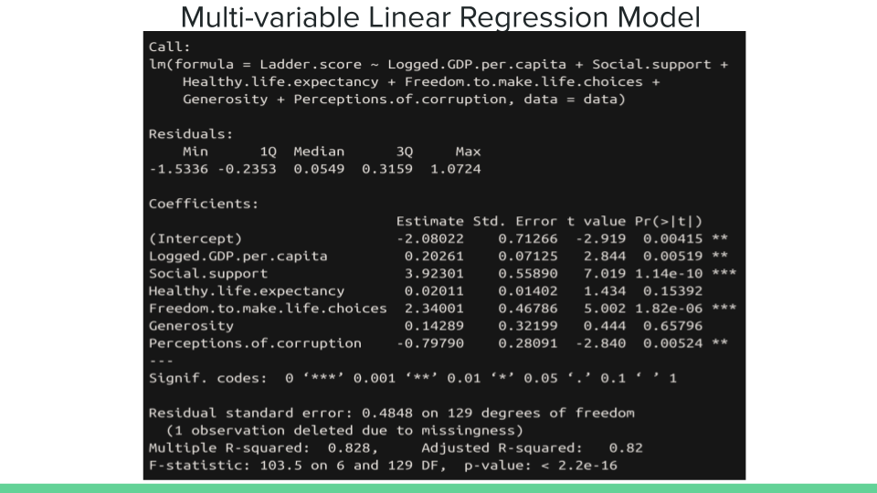

# Course Final Project :: CS301

**Due** : Thursday, 4th May 2023, 7:00pm (Note: Strict deadline, no extensions are possible)

## Names of all members

Brenden Gray
Nic Ingerson
Tuguldur Gantulga

## Group Name

grays-team

## Dataset reference

http://eprints.lse.ac.uk/47487/1/World%20happiness%20report%28lsero%29.pdf

https://papers.ssrn.com/sol3/papers.cfm?abstract_id=1796590

## In clear and meaningful language, discuss your three (foundational) questions.

## What motivation is there behind these questions?

For each question, be sure to describe and discuss; the method, the code, the results and the conclusions of your group. This work will take about the same time as two labs.

The motivation behind these questions is that we wanted to find the if the variables we chose are good indicators or not. Does having more material and living in a developed country produce more happiness? Moreover, we wanted out classmatess and peers know to not take their life and happiness for granted because we are in a country that is better than most when it comes to living conditions.

## Q1 How does GDP per capita of a country affect the overall Happiness Index Score: Method, Code and Conclusion

### Method: In order to see a summary of the p-values and adjusted R-squared values, we decided to run a linear regression model with all happiness index scores over all values. Here is the code:

```r
model <- lm( Ladder.score ~ Logged.GDP.per.capita + Social.support + Healthy.life.expectancy + Freedom.to.make.life.choices + Generosity + Perceptions.of.corruption, data=data)
summary(model)
```

Here is the output for the regression code above:




### Code: 

We chose to graph a comparison of all countries within the dataset as well as a selection of countries based on happiness index scores to see how other variables may affect them.

```r
# GDP per capita vs Happines Index Score

# All countries

ggplot(data, aes(x = Logged.GDP.per.capita, y = Ladder.score)) +
  geom_point(color = "blue") +
  geom_text(aes(label = Country.name), size = 3, hjust = 0, vjust = 0) +
  xlab("Logged GDP per capita") +
  ylab("Happiness index") +
  ggtitle("Correlation between GDP per capita and the happiness index score (all countries)")

# Few countries

some_countries <- data[c(1,5,9,15,30,36,47,64,83,100,110,126,129,137),]

ggplot(some_countries, aes(x = Logged.GDP.per.capita, y = Ladder.score)) +
  geom_point(color = "red") +
  geom_text(aes(label = Country.name), hjust = 0, vjust = 0) +
  xlab("Logged GDP per capita") +
  ylab("Happiness index") +
  ggtitle("Correlation between GDP per capita and the happiness index score (few countries)")
```

### Result:


### Conclusion:

We found that the p-value for the logged version of GDP Per capita is 0.00519, which is below the 0.05 significance level. Thus, we concluded that this variables is statisticaly significant. Therefore, we reject the null hypothesis. Moreover, the adjusted R-square value of 0.82 and as well as the graphs shows that logged GDP per capita is a good variable when it comes to determining the happiness index score of a country.

## Q2, Does having more freedom in life correlate with happiness?


### Method:

In order to see the correlation and the relationship, we decided to run a linear regression model and a ggplot to graph the relationship between the two variables

### Code:

```r

# Freedom vs happiness


# All countries
ggplot(data = data , aes(x = Freedom.to.make.life.choices, y = Ladder.score)) +
  geom_point(color = "blue") +
  xlab("Freedom to make life choices") +
  ylab("Happiness index") +
  ggtitle("Correlation between Freedom to make life choices and Happiness index (all countries)")

# Few countries

ggplot(data = some_countries , aes(x = Freedom.to.make.life.choices, y = Ladder.score)) +
  geom_point(color = "blue") +
  geom_text(aes(label = Country.name), hjust = 0, vjust = 0) +
  xlab("Freedom to make life choices") +
  ylab("Happiness index") +
  ggtitle("Correlation between Freedom to make life choices and Happiness index (few countries)")

```


Result:


### Conclusion:

We found that the p-value for freedom to make life choices is 1.82e-06 , which is way below the 0.05 significance level. Thus, we concluded that this variables is statistically significant. Therefore, we reject the null hypothesis in favor of the alternate hypothesis that the Freedom.to.make.life.choices is a great variable that explains the happiness index score for the countries. As you can see the plot, we can see a straight positive correlation between in those countries.

## Q3, Method, Code and Conclusion

Does being more generous correlate with more happiness?


### Method: In order to see the correlation and the relationship, we decided to run a linear regression model and a ggplot to graph the relationship between the two variables


### Code:

```r
# Generosity vs Happiness Index

# All countries

ggplot(some_countries, aes(x = Generosity, y = Ladder.score)) +
  geom_point(color = "blue") +
  geom_text(aes(label = Country.name), hjust = 0, vjust = 0) +
  xlab("Generosity") +
  ylab("Happiness index") +
  ggtitle("Correlation between Generosity and happiness index (few countries)")

# Few countries

ggplot(data = data , aes(x = Generosity, y = Ladder.score)) +
  geom_point(color = "blue") +
  xlab("Generosity") +
  ylab("Happiness index") +
  ggtitle("Correlation between Generosity and Happiness index (all countries)")
```


### Result:


### Conclusion:

Surprisingly, we found that the p-value for generosity is 0.65 , which is way above the 0.05 significance level. Thus, we concluded that this variables is statistically insignificant. Therefore, we accept the null hypothesis.  As you can see the plot, we can the plots are very dispersed and does not make much meaning between in those countries.

However, I think that it is hard to quantify generosity, and I believe the data could be faulty, but this needs more research. One would think that people who are generous would be happier, but this regression result does not conclude so.


## Q4, Method, Code and Conclusion?

Does a country having more social support from the government or other entities make its citizens more happy/affect the happiness index score?

### Method: In order to see the correlation and the relationship, we decided to run a linear regression model and a ggplot to graph the relationship between the two variables

### Code: 


```r

# Social Support

# All countries
ggplot(data = some_countries , aes(x = Social.support, y = Ladder.score)) +
  geom_point(color = "blue") +
  geom_text(aes(label = Country.name), hjust = 0, vjust = 0) +
  xlab("Social support") +
  ylab("Happiness index") +
  ggtitle("Correlation between Social Support and Happiness index (few countries)")

# Few countries
ggplot(data = data , aes(x = Social.support, y = Ladder.score)) +
  geom_point(color = "blue") +
  xlab("Social Support") +
  ylab("Happiness index") +
  ggtitle("Correlation between Social Support and Happiness index (all countries)")

```

### Result:


### Conclusion:

We found that the p-value for social support is 1.14e-10 , which is way below the 0.05 significance level. Thus, we concluded that this variable is statistically significant. Therefore, we reject the null hypothesis in favor of the alternate hypothesis that the Social.Support is a great variable that explains the happiness index score for the countries. As you can see the plot, we can see a straight positive correlation between in those countries.


---

(Did you remember to place the names of yourself and your group members above?)

yeah
